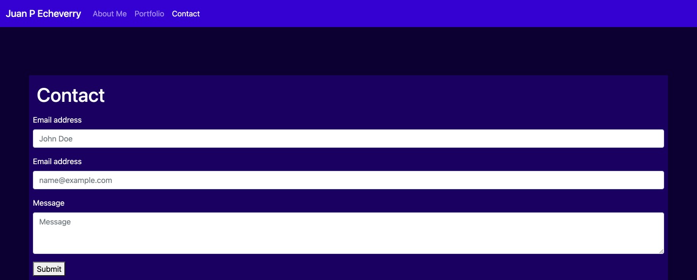

# My Portfolio

## Link to Website

jpecheverryp.github.io

## Introduction
A portfolio is probably the most powerful tool we developers have to show our work, it is meant to show our skills and also show our personality and style.
I created this portfolio that I plan on upgrading soon to make it more interesting to be able to show my projects.

## Files

### HTML
There are 3 different files with the HTML extension, these are the 3 different pages that can be accesed on the navbar

#### Index (About me)
Index.html is the main page of my portfolio, here we can see a little description of myself, on the first version there is only placeholder text, but it will be upgraded with real text soon.

#### Portfolio
The portfolio page shows my different projects, there are not really any projects to show right now, but the plan is to make some changes so I can show both the github repository and the live website on this page. This is probably the most important part of the website.

#### Contact
This page is created with the purpose of making communication between people or companies interested in my work and me.

### CSS

The CSS is mainly changes in color of text and backgrounds, since the website is using the Bootstrap library, there is not a lot of changers on the raw CSS of the page.

## Next Changes 

- Replace Placeholders 
    - About me Image
    - About me Text
    - Projects images
- Add buttons to link projects to github and live website
- Add LinkedIn, Github, Email and CV on contact page.

## Screenshots of the Website

### About Me

### Portfolio

### Contact
